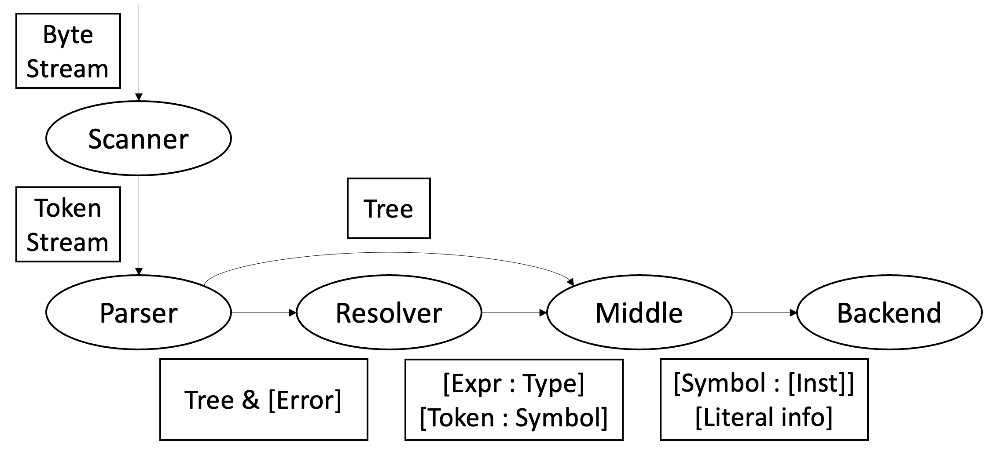

## Introduction

We have rewrote the SnuPL compiler in the Swift language.

### Building/Running our compiler

Seems like a bad idea to hijack the introduction with stuff like this,
but it feels even worse to put these instructions at the end.

If one is on an `aarch64-linux-gnu` machine...

```shellsession
$ # Building the compiler itself:
$ cd SwiftSnuPL
$ rm SwiftSnuPL # The binary already there is for x86_64 machines.
$ docker build -o . .
$ # A binary named SwiftSnuPL will appear.
$
$ ./SwiftSnuPL compile -S -o main.s main.mod
$ ./SwiftSnuPL stdlib -S -o libSnuPL.s
$ as -o main.o main.s
$ as -o libSnuPL.o libSnuPL.s
$ ld -o main \
  -dynamic-linker /lib/ld-linux-aarch64.so.1 \
  /usr/lib/aarch64-linux-gnu/crt1.o \
  /usr/lib/aarch64-linux-gnu/crti.o \
  -lc libSnuPL.o main.o \
  /usr/lib/aarch64-linux-gnu/crtn.o
$ ./main
```

On `x86_64` machines, the same `docker build` will build the compiler
as a native `x86_64` binary; the instructions for cross-compiling and
running SnuPL code in those environments are detailed at the end of
the report.

### Motivation

The unfamiliarity on the C++ language pushed us to experiment with
porting the compiler to a more familiar language.

Partially porting the parser to Swift showed a significant
productivity increase not only from familiarity but also from the
conciseness of the language, algebric data types, and pattern
matching.

We decided to use the Swift port as a sandbox for experimenting with
various design deviations from the original design.

### Design Goals

The following were the goals when starting the rewrite:

- Each phase has a component that is responsible for it.
- These components must communicate with plain data structures that do
  not have any behavioral knowledge of phases.
- To report multiple errors, each phase tries hard enough to make
  something, with a list of encountered errors.

While these goals were not totally achieved, we believe that our
compiler architecture is better than what was originally provided by
the C++ code.

The below picture is how the components of the SwiftSnuPL compiler
interacts; the arrows represent how the data structures get passed.



### Known Problems / Possible Improvements

The biggest known problem is that the `Resolver` does not do any error
handling in its current form. While the appropriate functions are
marked throwing, we did not have enough time to implement error
reporting.

## Phase 2: Syntax Analysis

The parser is a simple LL(1) parser.

### Model the AST as dumb sum types instead of subclasses

In our opinion, this encodes more naturally in code. This also allows
separating logic between stages are easier: we can pattern match the
AST nodes outside of the AST implementation, instead of relying on the
langauge’s dynamic dispatch. (Arguably this is just as possible with
implementing something like a visitor pattern, but this is even more
verbose.)

- Have the types `Expression`, `Statement`, `Type`, `Declaration` as a
  sum type (enumerations with associated values in Swift speech)
  - The target of an `.assignment` is an `Expression` for future
    extensions. (The parser only parses targets)
- Generates a complete parse tree without considering any

### Reuse of the CppSnuPL scanner

Thanks to the Swift’s C interop feature, we can reuse the C++
implementation of the scanner. The SPM target `CppSnuPL` and
`SwiftSnuPL/Scanner.swift` implements the scanner.

Off-topic, but this feature was pretty cool: throw in some C header
files, and the embbedded clang in the Swift compiler can transparently
import functions.

### Testing by pretty-printing

We have added a pretty printer PoC that allows regenerating compatible
SnuPL code from the parsed module. We’ve found some parser bugs by
parsing test cases, pretty printing, reparsing the code and comparing
the results.

- Have implemented a complete `Parser` and `Resolver`, a
  `TACGenerator` PoC is also implemented.

- Added a pretty printer PoC that allows regenerating compatible SnuPL
  code
  - Testing the parser by parsing, pprinting and reparsing, and
    comparing the results


### Implemented types and grammar of `Parser`

Below are the Swift types used to represent the AST.

Most are boring; one interesting point is that the AST represents
subroutines in calls and assignment targets as a generic `Expression`
instead of an identifier. The parser currently rejects any code that
doesn’t call a single identifier (and the resolver rejects while type
checking as well), but future language extensions might allow more
expressions (like an item of array of functions) to be callable as
well.

```swift
indirect enum Expression {
    case unary(`operator`: Token, value: Expression)
    case binary(`operator`: Token, `left`: Expression, `right`: Expression)
    case `subscript`(array: Expression, index: Expression)
    case call(function: Expression, arguments: [Expression])
    case variable(name: Token)
    case integer(Int32)
    case longint(Int64)
    case boolean(Bool)
    case char(UInt8)
    case string([UInt8])
}

indirect enum Statement {
    case assignment(target: Expression, value: Expression)
    case call(procedure: Expression, arguments: [Expression])
    case `if`(condition: Expression, thenBody: [Statement], elseBody: [Statement])
    case `while`(condition: Expression, body: [Statement])
    case `return`(value: Expression?)
}

indirect enum `Type` {
    case boolean
    case char
    case integer
    case longint
    case array(base: `Type`, size: Expression?)
}

struct Parameter {
    let name: Token
    let type: `Type`
}

indirect enum Declaration {
    case `var`(name: Token, type: `Type`)
    case `const`(name: Token, type: `Type`, initializer: Expression)
    case procedure(name: Token, parameters: [Parameter], block: Block?)
    case function(name: Token, parameters: [Parameter], `return`: `Type`, block: Block?)
}

struct Module {
    let name: Token
    let block: Block
}

struct Block {
    let declarations: [Declaration]
    let body: [Statement]
}
```

Below is the equivalent SnuPL grammar as implemented in the Swift
parser. Comments indicate the parser function that implemented the
associated grammar.

```ebnf
(* parseModule() *)
module = "module" ident ";"
         { constDeclarations | varDeclarations | functionDeclaration | procedureDeclaration }
         [ "begin" statements ] "end" ident "." ;

(* Declarations *)
(* parseVarDeclarations() -> [Declaration] *)
varDeclarations = "var" varDeclaration ";" { varDeclaration ";" } ;
varDeclaration = ident { "," ident } ":" type ;

(* parseConstDeclarations() -> [Declaration] *)
constDeclarations = "const" constDeclaration ";" { constDeclaration ";" } ;
constDeclaration = ident { "," ident } ":" type "=" expression ;

(* parseFunctionDeclaration() -> Declaration *)
functionDeclaration = "function" ident [ parameters ] ":" type ";"
                      ( "extern" | functionBody ident ) ";" ;
functionBody = [ constDeclarations ] [ varDeclarations ] "begin" statements "end" ;

(* parseProcedureDeclaration() -> Declaration *)
procedureDeclaration = "procedure" ident [ parameters ] ";"
                       ( "extern" | procedureBody ident ) ";" ;
procedureBody = [ constDeclarations ] [ varDeclarations ] "begin" statements "end" ;

(* parseParameters() -> [Parameter] *)
parameters = "(" parameterDeclarations ")" ;
parameterDeclarations = [ parameterDeclaration { ";" parameterDeclaration } ] ;
parameterDeclaration = ident { "," ident } ":" type ;

(* Statements *)
(* parseStatements() -> [Statement] *)
statements = [ statement { ";" statement } ] ;
(* parseStatement() -> Statement *)
statement = assignment | procedureCall | if | while | return ;
(* parseAssignment(target: Expression) -> Statement *)
assignment = subscript ":=" expression ;
(* parseProcedureCall(procedure: Expression) -> Statement *)
procedureCall = ident "(" [ expression { "," expression } ] ")" ;
(* parseIf() -> Statement *)
if = "if" "(" expression ")" "then" statements [ "else" statements ] "end" ;
(* parseWhile() -> Statement *)
while = "while" "(" expression ")" "do" statements "end" ;
(* parseReturn() -> Statement *)
return = "return" [ expression ] ;

(* Types *)
type = baseType { "[" [ plusMinus ] "]" } ;             (* parseType() -> `Type` *)
baseType = "boolean" | "char" | "integer" | "longint" ; (* parseBaseType() -> `Type` *)

(* Expressions *)
(* parseExpression() -> Expression *)
expression = relation ;
(* parseRelation() -> Expression *)
relation = plusMinus [ ( "=" | "#" | "<" | "<=" | ">" | ">=" ) plusMinus ] ;
(* parsePlusMinus() -> Expression *)
plusMinus = [ "+" | "-" ] mulDiv { ( "+" | "-" | "||" ) mulDiv } ;
(* parseMulDiv() -> Expression *)
mulDiv = primary { ( "*" | "/" | "&&" ) primary } ;
(* parsePrimary() -> Expression *)
primary = subscript | literal | "(" expression ")" | functionCall | "!" primary ;
(* parseLiteral() -> Expression *)
literal = number | boolean | char | string ;
(* parseSubscript() -> Expression *)
subscript = variable [ "[" plusMinus "]" ] ;
(* parseFunctionCall() -> Expression *)
functionCall = variable "(" [ expression { "," expression } ] ")" ;
(* parseVariable() -> Expression *)
variable = ident ;
```


## Phase 3: Semantic Analysis

The `Resolver` of SwiftSnuPL has two responsibilities:

- Resolving the tokens to the appropriate symbols
- Calculating the types of various expressions

Notably, instead of the parser resolving the symbols during parsing,
we handle symbol resolving in phase 3.

As SwiftSnuPL has static scoping rules, the notion of scopes do not
have to exist outside of the `Resolver`; it maintains an internal
stack of scopes during resolving, and the scopes do not have any
presence after this phase.

Scopes contain multiple `Symbol`s,

To support `const` symbols, the `Resolver` implements a simple
compile-time evaluator. Since the `Parser` only allows a separate

SwiftSnuPL also completes phase 3. The SwiftSnuPL Resolver handles
both symbol resolving and type checking, covering a subset of phase 2
and phase 3. The Resolver saves type and symbol information on an side
table separately from the parser AST. This not only allows the parser
to continue and parse the code, and report resolver errors in a batch,
but also allows centralizing resolving and type checking logic. The
resolver finally produces a map of AST nodes to type information and
resolved Symbols.


### Architecture

Resolver only receives tree of SnuPL/2 codes, then generate various
informations for later phase.
```swift
class Resolver {
    var module: Parser.Module // input

    // results
    var resolvedSymbols: [Token: Symbol] = [:]
    var resolvedTypes: [Parser.Expression: `Type`] = [:]
    var globalVariables: Set<String> = []
```

`module` is root node of tree, semantically it means whole source code
of SnuPL/2. It contains structures of source code, which determined at
earlier phase(parser). `resolvedSymbols` is dictionary that connects
`Token` and `Symbol`, which related to first responsibility of
resolver. `Symbol` is similar with `Token`, but it has ability to
check semantic equality between token. It will be explained more in
later part. `resolvedTypes` is dictionary that connects
`Parser.Expression` and `Resolver.Type`, which related to second
responsibility of resolver.

### Core Logic

Phase 3 starts from `resolve()` function.
```swift
func resolve() throws {
    func builtin(withSignature signature: StaticString) -> Symbol {
        // process signature...
        return .`var`(token: token, type: type)
    }

    let globalSymbols: Set<Symbol> = [
        builtin(withSignature: "DIM(_[] I)I"), builtin(withSignature: "DOFS(_[])I"),
        builtin(withSignature: "ReadInt()I"), builtin(withSignature: "ReadLong()L"),
        builtin(withSignature: "WriteInt(I)"), builtin(withSignature: "WriteLong(L)"),
        builtin(withSignature: "WriteChar(C)"), builtin(withSignature: "WriteStr(C[])"),
        builtin(withSignature: "WriteLn()"),
    ]

    resolveSymbol(of: module.name, as: builtin(withSignature: "main()"))
    try resolve(block: module.block, symbols: globalSymbols, return: nil)
}
```
At first global symbols such as `DIM()`, `DOFS()`, `WriteInt()` are
resolved and added in global scope. Then try resolve every source code
in main module. `resolve()` function has 3 different overload
types. One gets `Parser.Block`, other one gets `Parser.Statement`, and
last one gets `Parser.Expression`. Each function logic is pretty
straightforward - respond to case by case. However especially in
resolve `Parser.Block`, every declaration in that block are processed
before statements are resolved. variables/constants added into current
scope and resolved results added into `resolvedSymbol`.

```swift
func resolve(block: Parser.Block, symbols: Set<Symbol> = [], return: `Type`?) throws {
    var scope = Scope(symbols: symbols, return: `return`)
    for declaration in block.declarations {
        switch declaration {
        case .`var`(let name, let type):
            if block == module.block {
                scope.addGlobalVar(token: name, type: try withScope(scope) { try evaluate(type: type) })
                globalVariables.insert(name.string)
            } else {
                scope.addVar(token: name, type: try withScope(scope) { try evaluate(type: type) })
            }
            try withScope(scope) { try resolveSymbol(of: name) }
        // case by case...
        }
    }

    try withScope(scope) { for statement in block.body { try resolve(statement: statement) } }
}
```

And it is a example from resolving `.call` case of
`Parser.Expression`.
```swift
func resolve(expression: Parser.Expression) throws {
    switch expression {
    case .call(let function, let arguments):
        try resolve(expression: function)
        for argument in arguments { try resolve(expression: argument) }
        guard case .function(parameters: let parameters, return: let `return`) = try resolvedType(of: function)
        else { fatalError() }
        for (parameter, argument) in zip(parameters, arguments) {
            guard try resolvedType(of: argument).isConvertible(to: parameter) else { fatalError() }
        }
        resolveType(of: expression, as: `return`)
    // case by case...
    }
}
```

#### Helper Functions
Code belows are helper functions that managing outputs of resolver.
```swift
func resolveSymbol(of token: Token) throws {
    for scope in scopes.reversed() {
        if let symbol = scope.findSymbol(named: token.string) {
            resolveSymbol(of: token, as: symbol)
            return
        }
    }
    fatalError()
}

func resolveSymbol(of token: Token, as symbol: Symbol) { resolvedSymbols[token] = symbol }
func resolveType(of expression: Parser.Expression, as type: `Type`) { resolvedTypes[expression] = type }

func resolvedSymbol(of token: Token) throws -> Symbol {
    guard let symbol = resolvedSymbols[token] else { fatalError() }
    return symbol
}
func resolvedType(of expression: Parser.Expression) throws -> `Type` {
    guard let type = resolvedTypes[expression] else { fatalError() }
    return type
}
```
`resolveSymbol(Token)` find symbols in reverse order of nested scope,
which means find nearest symbol definition.


### Evaluation of Constants
Evaluation of constants are one of important role of resolver. Every
initializer of constant is `Parser.Expression`, so evaluation logic is
starts from this:
```swift
func evaluate<T: Hashable>(expression: Parser.Expression, as type: T.Type) throws -> T {
    try evaluate(expression: expression) as! T
}

func evaluate(expression: Parser.Expression) throws -> AnyHashable {
    switch expression {
    case .binary:
        // blabla...
    // case by case...
    }
}
```

It isn't that worth to comment about `evaluate()` implementation since
it is similar as parsing logic. However there is one thing in process
`.binary` case - arithmetic / equality / relational calculation is
implemented by generic of Swift primitive type.
```swift
func arithmetic<T: BinaryInteger>(as type: T.Type) throws -> T {
    let leftValue = try evaluate(expression: left, as: T.self)
    let rightValue = try evaluate(expression: right, as: T.self)
    switch `operator`.string {
    case "+": return leftValue + rightValue
    case "-": return leftValue - rightValue
    case "*": return leftValue * rightValue
    case "/": return leftValue / rightValue
    default: fatalError()
    }
}

func equality<T: Equatable & Hashable>(as type: T.Type) throws -> Bool {
    let leftValue = try evaluate(expression: left, as: T.self)
    let rightValue = try evaluate(expression: right, as: T.self)
    switch `operator`.string {
    case "=": return leftValue == rightValue
    case "#": return leftValue != rightValue
    default: fatalError()
    }
}

func relational<T: Comparable & Hashable>(as type: T.Type) throws -> Bool {
    let leftValue = try evaluate(expression: left, as: T.self)
    let rightValue = try evaluate(expression: right, as: T.self)
    switch `operator`.string {
    case "=": return leftValue == rightValue
    case "#": return leftValue != rightValue
    default: fatalError()
    }
}

// Real evaluation logic
if leftType == .integer && rightType == .integer {
    switch `operator`.string {
    case "+", "-", "*", "/": return try arithmetic(as: Int32.self)
    case "=", "#": return try equality(as: Int32.self)
    case "<", "<=", ">=", ">": return try relational(as: Int32.self)
    default: fatalError()
    }
} else if { // keep going...
```

### Semantic Rule Checklist

List below is semantic rules which we are considered during Phase 3:
- Type Checking
  - compatible type at binary, unary operator
  - compatible type at assignment, declaration
  - boolean expression on if, while statement
  - integer/longint range check
  - Procedure/Function
    - compatible declaration, return type
    - compatible parameter, argument type(and same number)
  - Array
    - dimension/int type check on subscript
    - size must be provided in declaration
- Valid Identifier
  - duplicate declaration in same scope
  - invalid(undefined) symbol
  - Module/Subroutine: identifier match
- SnuPL/2 specific issues
  - prohibit use of composite type in return and assign
  - implicit type conversion of array parameter, argument

Also there are some differences from CppSnuPL, or some decisions in
various candidates of semantic rules.

- prohibit implicit integer/longint conversion
- usage of strict constant folding
- Array subscription is only allowed with `integer` type. `longint`
  type isn't allowed.
- String constant declaration is only way to initialize array
  type. Conversely, it means that we can evaluate though some char
  constant's initial value is defined by subscript on string. It will
  be compiled successfully.
- Subarray in arguments is **allowed**. It depends on memory structure
  of array, so we will discuss in phase 4 parts.


### Enums and Structs

#### Type
`Type` in resolver is distinguished from `Type` in parser. In
resolver, it treat procedure/function as type, too. This mental model
helps processing procedure/function call, and easy to extend features
at SnuPL/2 such as array of procedure, or array of function.

```swift
indirect enum `Type`: Equatable, Hashable {
    case boolean
    case char
    case integer
    case longint
    case array(base: `Type`?, size: Int32?)  // base is only nil if array is untyped
    case procedure(parameters: [`Type`])
    case function(parameters: [`Type`], `return`: `Type`)

    var isScalar: Bool {
        switch self {
        case .boolean, .char, .integer, .longint: return true
        default: return false
        }
    }

    func isAssignable(to target: Self) -> Bool { target.isScalar && isConvertible(to: target) }

    func isConvertible(to target: Self) -> Bool {
        switch self {
        case .array(let base, let size):
                guard case .array(base: let targetBase, size: let targetSize) = target else { return false }
                guard let targetBase = targetBase else { return true }
                guard let base = base else { return false }
                guard base.isConvertible(to: targetBase) else { return false }
                guard let targetSize = targetSize else { return true }
                return size == targetSize
        // case by case...
        }
    }
}
```

`Type` has helpers like `isScalar`, `isAssignable`,
`isConvertible`. In case of compare array type in `isConvertible`, it
recursively compares type of `base` and `size`. Similar methods are
exist at CppSnuPL, but SwiftSnuPL declare different type
representation in different phase to accomplish separation of
concerns. Also from powerful Swift native features sum type like
`Type` can be implemented much shorter than C++.


#### Symbol
`Symbol` is semantic representation of variable and constant
tokens. According to this facts, enum `Symbol` is consisted of 2
cases.

```swift
enum Symbol: Equatable, Hashable {
    case `var`(token: Token, type: `Type`, isGlobal: Bool = false)
    case const(token: Token, type: `Type`, initializer: AnyHashable, isGlobal: Bool = false)

    var token: Token {
        switch self {
        case .`var`(let token, _, _): return token
        case .const(let token, _, _, _): return token
        }
    }

    var type: `Type` {
        switch self {
        case .`var`(_, let type, _): return type
        case .const(_, let type, _, _): return type
        }
    }

    var isGlobal: Bool {
        switch self {
        case .`var`(_, _, let isGlobal): return isGlobal
        case .const(_, _, _, let isGlobal): return isGlobal
        }
    }
}
```

Each case has `token`, `type`, `isGlobal` attributes in
common. `const` case has `initializer` attributes because constant
declaration forces initializing when declare it. `isGlobal` attributes
will used in Backend(Phase 5) to search variable/constant position in
memory, which are distinguished from local variable/constant in
sections to store.


#### Scope
`Scope` is defined, used in resolver, but it won't affect any other
phases. `Scope` is needed just checking semantic errors in source
code, and matching `Token` and `Symbol`. We are trying to hide
informations about SnuPL/2 grammar from other phases. struct `Scope`
has methods about adding new variable/constant, and search symbol in
current scope.

```swift
struct Scope {
    var symbols: Set<Symbol>
    let `return`: `Type`?

    mutating func addGlobalVar(token: Token, type: `Type`) {
        symbols.insert(.`var`(token: token, type: type, isGlobal: true))
    }
    mutating func addGlobalConst(token: Token, type: `Type`, initializer: AnyHashable) {
        symbols.insert(.const(token: token, type: type, initializer: initializer, isGlobal: true))
    }
    mutating func addVar(token: Token, type: `Type`) { symbols.insert(.`var`(token: token, type: type)) }

    mutating func addConst(token: Token, type: `Type`, initializer: AnyHashable) {
        symbols.insert(.const(token: token, type: type, initializer: initializer))
    }

    func findSymbol(named name: String) -> Symbol? { symbols.first(where: { $0.token.string == name }) }
}
```


## Phase 4: Intermediate Code Generation

### Architecture

The Swift `Generator` converts a parsed module with resolver
information to the IR, which is basically two dictionaries; a
symbol-to-instructions mapping that represents the TEXT section, and a
symbol-to-strings mapping that represents the DATA section. Also it
gets source code tree, too. As a result, Generator made linearize
tree - TAC - and some additional information about allocations and
string literals.
```swift
class IRGenerator {
    let module: Parser.Module
    let resolvedSymbols: [Token: Resolver.Symbol]
    let resolvedTypes: [Parser.Expression: Resolver.`Type`]

    var allocations: [String: Int64] = [:]
    var stringLiterals: [String: [UInt8]] = [:]
}
```

Module, procedure, function can be treated as independent source code
fracture, which means we can generate each of TAC. It leads generator
execution starts from module, and procedure/function declarations.
```swift
func generate() -> [Resolver.Symbol: [Instruction]] {
    var instructions: [Resolver.Symbol: [Instruction]] = [:]
    for declaration in module.block.declarations {
        switch declaration {
        case .procedure(let name, let parameters, let block):
            guard let block = block else { continue }
            let symbol = resolvedSymbol(of: name)
            instructions[symbol] = makeInstructions(parameters: parameters, block: block)
        case .function(let name, let parameters, _, let block):
            guard let block = block else { continue }
            let symbol = resolvedSymbol(of: name)
            instructions[symbol] = makeInstructions(parameters: parameters, block: block)
        default: continue
        }
    }
    let symbol = resolvedSymbol(of: module.name)
    instructions[symbol] = makeInstructions(module: module)
    return instructions
}
```

### Core Logic

The compilation to the IR is quite straightforward; There aren't many
things to explain internal implementation detail of
SwiftSnuPL. However, there are some interesting decisions for such features:

To allow passing subarrays between functions, the binary layout of
arrays are changed. Each array has a 8-byte header, consisting of two
4-byte little-endian integer values representing 1) the size of all
items (e.g. the size of items multiplied by the count of items), and
2) the size of one item. Nested arrays gets a nested layout.

This implementation allows arrays to be nested, and DIM can be
implemented as N-dimensional arrays get to have 8N bytes allocated as
a header, so calculating the length of the k-th dimension becomes
dividing the integer between the 2k-th integer and 2k+1-th integer.

Another advantage of the item size header is that we can dynamically
select store/load instructions, allowing for example passing integer
arrays to longint arrays, or vice versa.

This unfortunately means that storing an item to the array requires
two memory reads and a branch, which is probably quite detrimental to
performance. Thankfully we’re not concerned on performance at this
stage, so this working well is enough for us.

Another interesting tidbit is that we allocate the array on the stack,
even if the symbol for the array is global; due to how we do not give
any distinction between local arrays and passed arrays, all variables
typed array is basically just a pointer, even in the case where the
array was declared locally. In this case, it is the pointer to the
stack allocation that becomes a global symbol.

According to this change, array declaration is processed like below:
```swift
func makeInstructions(block: Parser.Block) -> [Instruction] {
    var instructions: [Instruction] = []
    for declaration in block.declarations {
        switch declaration {
        case .`var`(let name, _):
            let symbol = resolvedSymbol(of: name)
            guard case .`var`(_, let type, _) = symbol else { fatalError() }
            if case .array = type {
                instructions.append(.move(destination: .symbol(symbol), source: makeAllocation(ofSize: type.size)))
                var depth = 0
                var count = 1
                var type = type
                let pointerOperand = makeTemporary()
                while case .array(let base, let size) = type, let base = base, let size = size {
                    for i in 0..<count {
                        instructions.append(
                            .binary(
                                op: .add, destination: pointerOperand, source1: .symbol(symbol),
                                source2: .constant(Int64(8 * depth) + Int64(i) * type.size)))
                        instructions.append(
                            .store(
                                source: .constant(base.size * Int64(size)), destination: pointerOperand, size: .word
                            ))
                        instructions.append(
                            .binary(
                                op: .add, destination: pointerOperand, source1: pointerOperand,
                                source2: .constant(4)))
                        instructions.append(
                            .store(source: .constant(base.size), destination: pointerOperand, size: .word))
                    }
                    depth += 1
                    count *= Int(size)
                    type = base
                }
            }
        // case by case...
        }
    }
    instructions.append(contentsOf: makeInstructions(statements: block.body))
    return instructions
}
```

At first allocations of array size is made before initializing. Then
loop through depth 0 to last, we have to generate several addition
instructions since array size cannot be determined statically. Storing
these calculated every subarray headers are needed, too.

Array subscription is processed like below:
```swift
func makeInstructions(statement: Parser.Statement) -> [Instruction] {
    switch statement {
    case .assignment(let target, let value):
        var instructions: [Instruction] = []
        if case .subscript(let array, let index) = target {
            let valueOperand = makeTemporary()
            instructions.append(contentsOf: makeInstructions(expression: value, to: valueOperand))
            let targetOperand = makeTemporary()
            instructions.append(contentsOf: makeInstructions(expression: array, to: targetOperand))
            let sizeOperand = makeTemporary()
            let offsetOperand = makeTemporary()
            let indexOperand = makeTemporary()
            instructions.append(
                .binary(op: .add, destination: sizeOperand, source1: targetOperand, source2: .constant(4)))
            instructions.append(.load(destination: sizeOperand, source: sizeOperand, size: .word))
            instructions.append(contentsOf: makeInstructions(expression: index, to: indexOperand))
            instructions.append(
                .binary(op: .mul, destination: offsetOperand, source1: sizeOperand, source2: indexOperand))
            instructions.append(
                .binary(op: .add, destination: offsetOperand, source1: offsetOperand, source2: .constant(8)))
            instructions.append(
                .binary(op: .add, destination: targetOperand, source1: targetOperand, source2: offsetOperand))

            let byteLabel = makeLabel()
            let wordLabel = makeLabel()
            let endLabel = makeLabel()

            instructions.append(.branch(destination: byteLabel, source1: sizeOperand, source2: .constant(1)))
            instructions.append(.branch(destination: wordLabel, source1: sizeOperand, source2: .constant(4)))
            instructions.append(.store(source: valueOperand, destination: targetOperand, size: .doubleWord))
            instructions.append(.jump(destination: endLabel))
            instructions.append(.label(name: wordLabel))
            instructions.append(.store(source: valueOperand, destination: targetOperand, size: .word))
            instructions.append(.jump(destination: endLabel))
            instructions.append(.label(name: byteLabel))
            instructions.append(.store(source: valueOperand, destination: targetOperand, size: .byte))
            instructions.append(.label(name: endLabel))
        }
        return instructions
        // case by case...
    // case by case...
    }
}
```

**Explain needed**

#### Helper Functions
There are helper functions related to make labels, temporary
values, or manage information about allocations and string literals.
```swift
var labelID = 0
var operandID = 0
var allocationID = 0
var stringID = 0

func makeLabel() -> String {
    let labelName = "lbl\(labelID)"
    labelID += 1
    return labelName
}

func makeTemporary() -> Operand {
    let name = "tmp\(operandID)"
    operandID += 1
    return .temporary(name: name)
}

func makeAllocation(ofSize size: Int64) -> Operand {
    let name = "alloc\(allocationID)"
    allocations[name] = size
    allocationID += 1
    return .allocation(name: name)
}

func makeLiteral(string: [UInt8]) -> Operand {
    let name = "string\(stringID)"
    stringLiterals[name] = string
    stringID += 1
    return .string(name: name)
}
```

### Enums and Structs

The IR is almost the same with the provided CppSnuPL TAC;

`Operand` represents 64-bit scalar values that can either be a
constant, a register value, or a value on the stack. Stack allocations
are represented as pointers as well. Only the `.symbol` and
`.temporary` cases are modifiable; others are constant operands.

We did not model this distinction as separate types for brevity;
though we could have separate types for mutable operands and constant
operands, and declare the IR more strictly.

```swift
enum Operand: Equatable, Hashable {
    case constant(Int64)
    case temporary(name: String)
    case string(name: String)
    case allocation(name: String)
    case symbol(Resolver.Symbol)
}
```

The IR is modeled as below:

```swift
enum Instruction {
    case move(destination: Operand, source: Operand)
    case unary(op: UnaryOp, destination: Operand, source: Operand)
    case binary(op: BinaryOp, destination: Operand, source1: Operand, source2: Operand)
    case parameter(destination: Operand, index: Int)

    case jump(destination: String)
    case branch(destination: String, source1: Operand, source2: Operand)  // branch if equal
    case call(destination: Operand?, symbol: Resolver.Symbol, arguments: [Operand])
    case `return`(value: Operand?)

    case load(destination: Operand, source: Operand, size: MemorySize)
    case store(source: Operand, destination: Operand, size: MemorySize)

    case label(name: String)
}
```

As we can see, `UnaryOp` and `BinaryOp` is defined in generator. They
are defined like this:
```swift
enum UnaryOp: Equatable, Hashable {
    case neg
    case pos
    case not
}

enum BinaryOp: Equatable, Hashable {
    case add
    case sub
    case mul
    case div
    case and
    case or

    case eq
    case neq
    case lt
    case leq
    case gt
    case geq
}
```

Finally, since SnuPL/2 has 3 types of memory size of their primitive
types, it is defined as enum `MemorySize`.
```swift
enum MemorySize: Equatable, Hashable {
    case byte
    case word
    case doubleWord
}
```

## Phase 5: Code Generation

### SwiftSnuPL code generation implementation notes

The SwiftSnuPL compiler only supports the target triple
`aarch64-linux-gnu`. Notably, the generated code uses a Linux ABI,
with little endian semantics. For other platforms, linking to the
aarch64 libc and running the resulting binary with user mode qemu is
recommended. Detailed instructions for running binaries are noted
below.

The SwiftSnuPL compiler uses a very simplistic model where every
operand gets allocated a separate stack space, without any
optimization attempts. Each IR instruction gets compiled to loads from
the stack, a few aarch64 instructions that corresponds to the IR, and
stores to the stack.

Because this is so simplistic, implementing itself is a breeze, with
the checks for cases where immediate values don’t fit in the
instruction, and needs separate checks. There are quite a few
shortcomings on this model: the biggest one is that successive
operations operating on the same operand compiles to successive stores
and loads on the same memory location. Properly fixing this problem
would require some kind of register allocation scheme; a much
simplistic approach could aim at least optimize useless loads by
peeking the previous instruction and checking if an operand we needs
already exists in a register, and optimizing the load into a move.

We have a version of this patch implemented, but due to correctness
concerns, it is disabled by default.

Another would be that the compiler allocates every operand separately
on the stack; this results in using a lot of stack space. A proper
solution here would be doing some sort of liveness analysis on the IR,
and allocating the same place on the stack. Unfortunately we could not
implement this due to time constraints; we were hopefully out of
schedule and had to aim the quickest path to completion.

Overall, the assembly generation part of the compiler was

### Architecture

The code generator receives four inputs, as shown below:

```swift
class AssemblyGenerator {
    var instructions: [Resolver.Symbol: [IRGenerator.Instruction]]
    var allocations: [String: Int64]
    var stringLiterals: [String: [UInt8]]
    var globalVariables: Set<String>
}
```

The dictionary `instructions` is the direct output of the IR
generator, each containing the instructions for each function.


The dictionary `stringLiterals` and `allocations` are a separate
dictionary that has the information of the `.string` and `.allocation`
operands in the instructions; the special handling of string literals
is required as it is the only case in the language where literals must
be compiled as pointers, instead of immediate values that can be
directly embedded in the instructions.

Variables aren't contained directly, but it will be accessed when loop
through main module/procedure/function instructions. `allocations`
used to calculate size of some operands(IR). `stringLiterals` used to
embed string literals on data section. Since string is not special
type in SnuPL/2(it's just array of char), so embedding has to satisfy
middleware structure of array.

The set `globalVariables` contains global variable names, separately
taken from the `Resolver`; they are used to generate a symbol for each
global in the data section.

Passing `globalVariables` to the code generator is not intended
design; we realized only a bit too late that code can reference
variables outside of scope, and that our IR representation do not have
enough information about the nonlocal symbols. We would have liked a
better model of representing them, e.g. for future extensions of the
language that allows nested functions. Unfortunately time constraints
forced us to do something that obviously works; we did not have enough
time to rework the design.

If we had spent more thought designing the IR with a better
representation of the nonlocal symbols, e.g. by also saving the scope
depth of such symbol, we could have possibly implemented nested
functions with access links, and implement global variables as stack
variables of the `main` function; Unfortunately that was not possible.

Running through the instructions, collecting all operands, and with
the `allocations` dictionary, the code generator allocates stack space
to each operand, and store the stack locations into a dictionary
called `stackMapping`.

Structure of assembly codes are related to binary file format. It
starts with text section, where generated assembly code will placed.
After that, data section located. We allocate space for global
variables and string literals in here.

```swift
func generate() -> String {
    var assembly = """
        \t.text
        \(instructions.map(generate(symbol:instructions:)).joined(separator: "\n"))
        \t.data\n
        """
    for globalVariable in globalVariables { assembly += "\t.comm \(globalVariable),8\n" }
    for (key, value) in stringLiterals {
        assembly += """
            \(key):
            \t.word \(value.count + 1)
            \t.word 1\n
            """
        for char in value { assembly += "\t.byte \(char)\n" }
        assembly += "\t.byte 0\n"
    }
    return assembly
}
```

Each symbol in `instructions` represents a function or procedure; we
iterate through the dictionary and generates assembly code for each
symbol.

Code generation for a specific function starts by calculating the
stack layout.

It collects all local operands of the instructions; combined with the
`allocations` dictionary, the code generator allocates stack space to
each operand, and store the stack locations into a dictionary called
`stackMapping`. Also note that the ARM64 ISA requires the stack
pointer to be always aligned to the 16bits boundary; we add padding to
account that so that the stack size becomes a multiply of 16.

```swift
func generate(symbol: Resolver.Symbol, instructions: [IRGenerator.Instruction]) -> String {
    let operands = operands(in: instructions)
    var stackMapping: [IRGenerator.Operand: Int64] = [:]
    var stackSize: Int64 = 0
    for operand in operands {
        let size = size(of: operand)
        stackMapping[operand] = stackSize
        stackSize += size
    }
    if stackSize % 16 != 0 { stackSize += 16 - (stackSize % 16) }
    // assembly code generation...
```

### Implementation Notes

#### Handling Big Constants

To handle constants bigger than the limit of immediate values in one
instruction, we have a separate helper function `embedImm` that
generates assembly to split up the constant and moves them in pieces.

```swift
func embedImm(imm: Int64, scratch scratchRegister: String) -> String {
    if imm < 0 {
        return """
            \tmov \(scratchRegister), #\(imm % (1 << 16))
            \tmovk \(scratchRegister), #\((imm >> 16) % (1 << 16)), LSL 16
            \tmovk \(scratchRegister), #\((imm >> 32) % (1 << 16)), LSL 32
            \tmovk \(scratchRegister), #\((imm >> 48) % (1 << 16)), LSL 48
            """
    } else {
        var retasm = "\tmov \(scratchRegister), #\(imm % (1 << 16))\n"
        if imm >= (1 << 16) { retasm += "\tmovk \(scratchRegister), #\((imm >> 16) % (1 << 16)), LSL 16\n" }
        if imm >= (1 << 32) { retasm += "\tmovk \(scratchRegister), #\((imm >> 32) % (1 << 16)), LSL 32\n" }
        if imm >= (1 << 48) { retasm += "\tmovk \(scratchRegister), #\((imm >> 48) % (1 << 16)), LSL 48\n" }
        return retasm
    }
}
```

#### Load/Storing Operands

As mentioned upwards, each IR instruction loads and stores the
involved operands; the helper function `withOperands` produces most of
the load/store logic.

It adds assembly code for loading and storing the operands on the top
and the bottom of the provided code; an example use case of the
function is below.

```swift
case .unary(let op, let destination, let source):
    assembly += withOperands(
        load: [source], to: ["x8"],
        store: [destination], from: ["x8"],
        scratch: "x10"
    ) {
        switch op {
        case .neg:
            return """
            mov x9, xzr
            subs x8, x8, x9
            """
        // handle other cases...
        }
    }
```

The arguments `load` and `to` represents the operand/register pair
that will get loaded to. Likewise, the `store` and `from` represents
the operand/register pair that will get saved from.

The `scratch` register is required for calculating the stack position
of an operand in the case where the stack location is bigger than 256
and does not fit in the limit of immediate values.

The `offset` parameter, not used above, is for when the stack pointer
is changed for some reason. This is required when passing more than 8
arguments; to pass the arguments on the stack, the stack must be
expanded, messing up the stack location.

Note the branch on the size of `stackOffset`: it selects the
appropriate instruction that allows the format.

```swift
func withOperands(
    load sourceOperands: [IRGenerator.Operand] = [], to sourceRegisters: [String] = [],
    store destinationOperands: [IRGenerator.Operand] = [], from destinationRegisters: [String] = [],
    scratch scratchRegister: String, offset stackExpanded: Int64 = 0, body: (() -> String)? = nil
) -> String {
    var assembly = ""
    for (operand, register) in zip(sourceOperands, sourceRegisters) {
        switch operand {
        case .symbol(let symbol):
            let stackOffset = stackMapping[operand]! + stackExpanded
            if symbol.isGlobal {
                assembly += """
                    adrp \(register), \(symbol.token.string)
                    add \(register), \(register), :lo12:\(symbol.token.string)
                    ldr \(register), [\(register)]
                    """
            } else {
                if stackOffset < 256 {
                    assembly += "ldr \(register), [sp, #\(stackOffset)]"
                } else if stackOffset < 4096 {
                    assembly += """
                        add \(register), sp, #\(stackOffset)
                        ldr \(register), [\(register)]
                        """
                } else {
                    assembly += embedImm(imm: stackOffset, scratch: scratchRegister);
                    assembly += """
                        add \(register), sp, \(scratchRegister)
                        ldr \(register), [\(register)]
                        """
                }
            }
        // handle other cases...
        }
    }
    if let body = body { assembly += body() }
    for (operand, register) in zip(destinationOperands, destinationRegisters) {
        switch operand {
        // handle other cases...
        }
    }
    return assembly
}
```


#### Get List of Every Operands in Procedure/Function

Procedure/Function has instruction list made by middleware. By loop
through it, controlling case by case, set of operands are made like
this:

```swift
func operands(in instruction: IRGenerator.Instruction) -> Set<IRGenerator.Operand> {
    switch instruction {
    case .move(let destination, let source), .unary(_, let destination, let source): return [source, destination]
    case .binary(_, let destination, let source1, let source2): return [source1, source2, destination]
    case .parameter(let destination, _): return [destination]
    case .jump: return []
    case .branch(_, let source1, let source2): return [source1, source2]
    case .call(let destination, _, let arguments):
        var operands: Set<IRGenerator.Operand> = []
        for argument in arguments { operands.insert(argument) }
        if let destination = destination { operands.insert(destination) }
        return operands
    case .return(let value): if let value = value { return [value] } else { return [] }
    case .load(let destination, let source, _), .store(let source, let destination, _):
        return [source, destination]
    case .label: return []
    }
}
```


### Cross-compiling `aarch64-linux-gnu` code in x86_64 environments

For building, `binutils` for assembling and linking, and `libc` for
the `aarch64-linux-gnu` target triple is required.

The easiest way for running the produced binaries is by running them
with QEMU user mode.

Assuming an Ubuntu 20.04 environment, the following commands produce
an `aarch64-linux-gnu` binary and run it with `qemu-user`.

```shellsession
$ sudo apt-get update
$
$ # Install required packages
$ sudo apt-get install binutils-aarch64-linux-gnu libc-dev-arm64-cross
$
$ # Compile, assemble, and link the binary
$ ./SwiftSnuPL compile -S -o main.s main.mod
$ ./SwiftSnuPL stdlib -S -o libSnuPL.s
$ aarch64-linux-gnu-as -o main.o main.s
$ aarch64-linux-gnu-as -o libSnuPL.o libSnuPL.s
$ aarch64-linux-gnu-ld -o main \
  -dynamic-linker /lib/ld-linux-aarch64.so.1 \
  /usr/aarch64-linux-gnu/lib/crt1.o \
  /usr/aarch64-linux-gnu/lib/crti.o \
  -lc libSnuPL.o main.o \
  /usr/aarch64-linux-gnu/lib/crtn.o
$
$ # Run the binary with QEMU user mode
$ sudo apt-get install qemu-user
$ qemu-aarch64 -L /usr/aarch64-linux-gnu ./main
```

## Discussion & Conclusion
Building compiler was interesting task, though it is consisted of
really long and many phases. We studied many things about building
compiler, and there are many things which only addressed
theoretically, not practically. It suggests many ways to search for
deepen section of compiler that attracts us.

We think our compiler architecture design becomes more better, and
basic features of compilers are implemented well. However there are
some points such as peephole optimization, accurate error message,
various compile target, etc, which we can't finish because of time
limit =( 

Also, when we decided to rewrite everything in Swift, it seems really
really interesting but also worried. However we eventually made some
executable binary file (which isn't that good in
performance). Especially in last phase, we felt that: The more
interesting in Computer Architecture course was, the more difficult to
build a compiler. 
